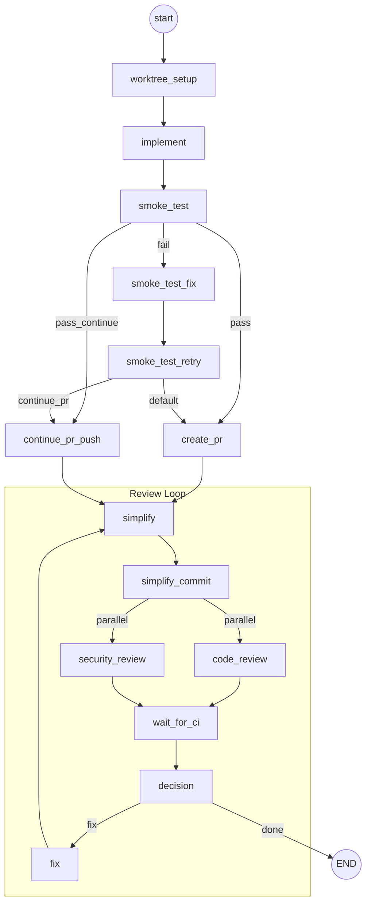
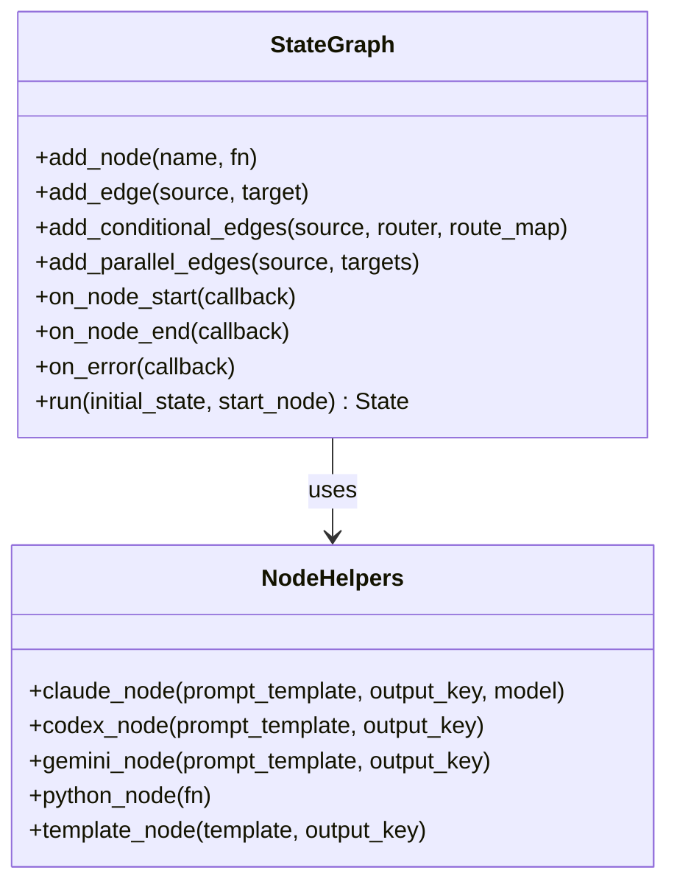

# Workflow Engine Architecture

## Graph Execution Flow

## Entry Points

| Mode | Start Node | Description |
|------|-----------|-------------|
| Default | `worktree_setup` | Creates worktree, implements, creates PR, reviews |
| `--continue-pr` | `implement` | Implements in current dir, pushes to existing PR, reviews |
| `--review-only` | `simplify` | Reviews an existing PR (no implementation) |

## Engine Components

